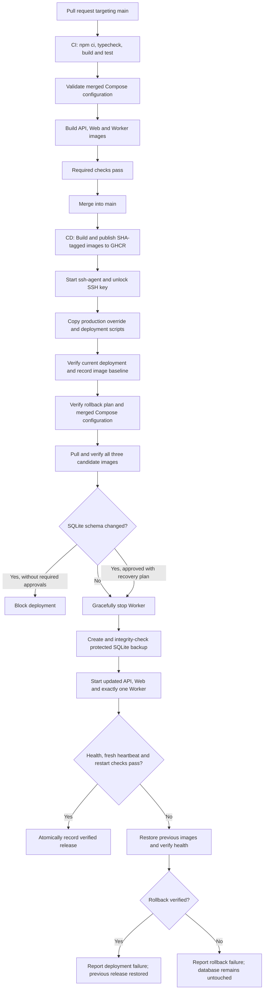

# Vault Automater — GitHub Actions CI/CD

## 1. GitHub Actions Deployment Setup

Before enabling the deployment job, create the GitHub environment named `production` and add these secrets to it:

| Secret | Purpose |
|---|---|
| `SSH_HOST` | Production server hostname or IP |
| `SSH_USER` | SSH deployment account |
| `SSH_PRIVATE_KEY` | Deployment account's private SSH key |
| `SSH_KNOWN_HOSTS` | Independently verified SSH host key |
| `SSH_KEY_PASSPHRASE` | Passphrase for the deployment key, if applicable |

`SSH_KNOWN_HOSTS` must contain the exact, independently verified `known_hosts` line for the production host. Do not add fake values.

The deployment account must be able to:

- Run Docker Compose for the `vault-automater` project.
- Read `/opt/vault-automater/.env`.
- Write to `/opt/vault-automater/.deploy` and `/var/backups/vault-automater`.

It should not be granted access to unrelated Docker projects or server users.

### GitHub Container Registry (GHCR)

The workflow uses GitHub's automatic `GITHUB_TOKEN` for GHCR publishing. A manually created token is not required.

| Job | Required permission |
|---|---|
| `publish` | `packages: write` |
| `deploy` | `packages: read` |

The GHCR package settings must allow the repository's `GITHUB_TOKEN` to read the container packages.

The Web image receives this fixed production build argument:

```text
https://vault.wickhub.cc
```

### Branch Protection and Deployment Trigger

CI runs on pull requests targeting `main`.

Before merging, make the `checks-and-images` job a required status check in the repository's `main` branch ruleset.

CI also validates the base Compose file merged with the production override. This validation uses placeholder image values and does not start containers.

CD runs only on pushes to `main`, including a normal merged pull request.

The deployment job retains `environment: production`, so its approval rules and environment secrets apply when configured.

---

## 2. CI/CD Flow



---

## 3. First Deployment and Rollback Baseline

The first automated deployment does not blindly replace the current manual deployment.

Before replacement, the pipeline:

1. Checks the currently running API, Web and Worker.
2. Verifies their health and a fresh Worker heartbeat.
3. Records the exact local image IDs for all three services.
4. Verifies that the rollback plan can resolve those images.

Later deployment failures roll back to this baseline or to the previous verified GHCR release.

Release state is parsed as strict key-value data and written atomically. Neither `eval` nor `source` is used.

---

## 4. Worker Shutdown and Database Backup

The Worker is stopped using the Docker Compose grace period before the final database backup is created.

The SQLite backup:

- Uses `VACUUM INTO`.
- Is checked with `PRAGMA integrity_check`.
- Is stored with file mode `0600` in a directory with mode `0700`.

A schema fingerprint is compared against a disposable database initialized by the candidate API image.

Schema changes are blocked unless the production environment provides both reviewed configuration variables:

- `SQLITE_MIGRATION_APPROVAL`
- `SQLITE_RECOVERY_PLAN`

---

## 5. Deployment Verification and Failure Recovery

A release is marked as verified only after the required health, fresh Worker heartbeat and container restart checks pass.

If deployment fails, the pipeline restores the exact previous images and checks their health again.

**Rollback restores images only. It never automatically overwrites the production database.**

If an incompatible SQLite schema prevents recovery, the pipeline reports the backup path for a separately reviewed recovery procedure.